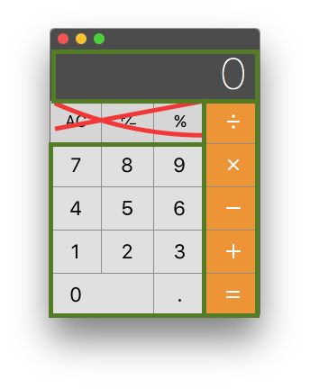

# calculator
iOS-like calculator using vanilla JS, HTML5, and CSS3

## Description
A rudimentary calculator, with a classic interface similar to those found in many settings, including the one in several Apple products, like iOS and OSX. The below image is a screenshot from MacOS, not necessarily the finished product from this repo.

Input to the calculator comes via mouse clicks to HTML elements.
All input is echoed to the response pane, with results rendered on press of any (orange) operation button. Order of operations and chained operations (see  Testing, below) is be supported. Rational numbers are supported. 

It will show an error on any division by zero or overflow beyond 10 digits.

The other buttons (` AC `, ` ± ` and ` % `) are not supported for now. 

## Constraints
Use only:
- Javascript
- HTML
- CSS

No 3rd party libraries or frameworks, implemented entirely in the native structures offered in the above standards.

## Testing
Some example interactions with the calculator are provided below.

Example 1: Rational Addition Example

| Input 	| Result Pane 	|
|------:	|-------------	|
| 2     	| 2           	|
| 3     	| 23          	|
| .     	| 23.         	|
| 5     	| 23.5        	|
| +     	| 23.5        	|
| 7     	| 7           	|
| =     	| 29.5        	|

Example 2: Chained Operations

| Input 	| Result Pane 	|
|------:	|-------------	|
| 2     	| 2           	|
| +     	| 2           	|
| 3     	| 3           	|
| -     	| 5           	|
| 1     	| 1           	|
| 7     	| 17          	|
| =     	| -12         	|

Example 3: Chained and Ordered 

| Input 	| Result Pane 	|
|------:	|-------------	|
| 2     	| 2           	|
| +     	| 2           	|
| 3     	| 3           	|
| *     	| 3           	|
| 8     	| 8           	|
| =     	| 26          	|

Example 4: Division by Zero

| Input 	| Result Pane 	|
|------:	|-------------	|
| 2     	| 2           	|
| /     	| 2           	|
| 0     	| 0           	|
| =     	| Undefined   	|

Example 5: Overflow 10 digits

| Input 	| Result Pane 	|
|------:	|-------------	|
| 2     	| 2           	|
| 0     	| 20          	|
| 0     	| 200         	|
| 0     	| 2000        	|
| 0     	| 20000       	|
| *     	| 20000       	|
| 9     	| 9           	|
| 9     	| 99          	|
| 9     	| 999         	|
| 9     	| 9999        	|
| 9     	| 99999       	|
| *     	| 1799820000  	|
| 9     	| 9           	|
| =     	| Error       	|